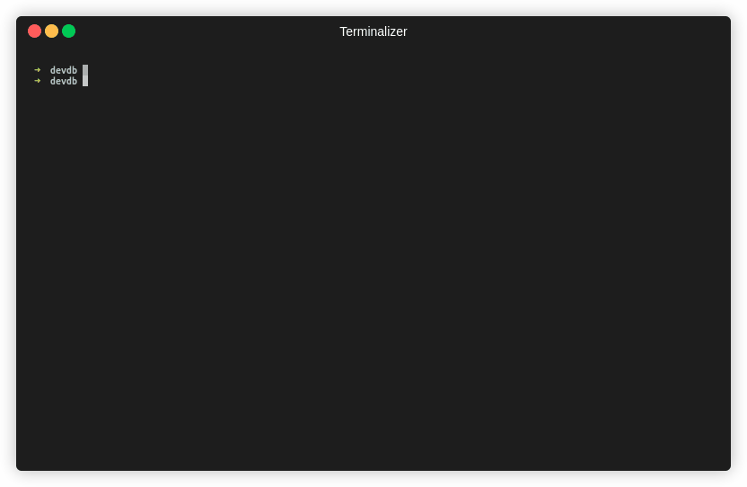

<!-- Improved compatibility of back to top link: See: https://github.com/othneildrew/Best-README-Template/pull/73 -->
<a name="readme-top"></a>

<div align="center">
  <a href="https://github.com/rorylshanks/devdb-client">
    
  </a>

<h3 align="center">DevDB Command Line Client</h3>

  <p align="center">
    A CLI client for accessing and automating DevDB
    <br />
    <a href="https://docs.devdb.cloud/"><strong>Explore the docs »</strong></a>
    <br />
    <br />
    <a href="https://devdb.cloud/">View Demo</a>
    ·
    <a href="https://github.com/rorylshanks/devdb-client/issues">Report Bug</a>
    ·
    <a href="https://github.com/rorylshanks/devdb-client/issues">Request Feature</a>
  </p>
</div>

<!-- ABOUT THE PROJECT -->
## About The Project



This is the CLI component for DevDB - a developer-focused database management platform. With DevDB you can quickly create databases for development and testing purposes, without the complexity of maintaining shared databases or Docker images.

<p align="right">(<a href="#readme-top">back to top</a>)</p>

### Installation

1. Get an API key from your account at https://devdb.cloud/
2. Install the command line client with NPM  
    ```
    sudo npm i -g devdb-cli@latest
    ```
3. Export the DEVDB_API_KEY environment variable  
    ```
    export DEVDB_API_KEY=ENTER_API_KEY_HERE
    ```
4. Start creating databases!

<p align="right">(<a href="#readme-top">back to top</a>)</p>


<!-- USAGE EXAMPLES -->
## Usage

# DevDB CLI Documentation

The DevDB CLI provides several useful commands to manage your DevDB databases, snapshots, and images.

## Commands

### create-database
**Aliases**: `create`, `up`

**Description**: Launch a database.

**Usage**: 
```bash
create-database --type <databaseType> [options]
```

**Options**:
* `-t, --type`: The type of database you want to create in DevDB. This option is required.
* `-n, --name`: Name of the created database.
* `-i, --image`: Image to create the database from.
* `-p, --proxy`: Start DevDB client in proxy mode (requires socat to be installed, unless running in Docker).
* `--proxyPort`: Local port to listen on for proxy mode.
* `--username`: Desired username to use for the database. When unset a random username will be generated.
* `--password`: Desired password to use for the database. When unset a random password will be generated.
* `--reconnect`: Reconnect to the database with the specified name, if it exists. If it doesn't exist, it will create normally.

---

### list-databases
**Aliases**: `ld`, `list`

**Description**: List databases.

**Usage**: 
```bash
list-databases
```

---

### get-database-types

**Description**: Get available database types.

**Usage**: 
```bash
get-database-types
```

---

### delete-database
**Aliases**: `delete`, `rm`

**Description**: Delete database.

**Usage**: 
```bash
delete-database <databaseId>
```

---

### create-snapshot
**Aliases**: `snapshot`

**Description**: Create a snapshot from an existing database.

**Usage**: 
```bash
create-snapshot <databaseId> [snapshotName]
```

**Options**:
* `-n, --snapshotName`: Name of the created snapshot.

---

### create-image
**Aliases**: `ci`

**Description**: Create image from running database.

**Usage**: 
```bash
create-image <databaseId> [snapshotName]
```

**Options**:
* `-n, --snapshotName`: Name of the created image. This option is required.

---

### list-snapshots
**Aliases**: `ls`

**Description**: List all snapshots.

**Usage**: 
```bash
list-snapshots <databaseId>
```

---

### list-images
**Aliases**: `li`

**Description**: List all images.

**Usage**: 
```bash
list-images
```

---

### delete-snapshot
**Aliases**: `rms`

**Description**: Delete snapshot from DevDB.

**Usage**: 
```bash
delete-snapshot <snapshotId>
```

---

### delete-image
**Aliases**: `rms`

**Description**: Delete image from DevDB.

**Usage**: 
```bash
delete-image <imageId>
```

---

### rollback-database
**Aliases**: `rb`, `rollback`

**Description**: Rollback database.

**Usage**: 
```bash
rollback-database <databaseId> [snapshotId]
```

**Options**:
* `--snapshotId, --snapshot`: ID of the snapshot to rollback to. Defaults to the most recent snapshot.

---

### Global options

**Options**:
* `-k, --apikey`: API Key to access DevDB (or from env var DEVDB_API_KEY).
* `--manifest`: Write a JSON output manifest file with the detailed results of the requested command.

---

To get help for any command, you can use the `--help` flag after the command.

<p align="right">(<a href="#readme-top">back to top</a>)</p>

<!-- LICENSE -->
## License

Distributed under the Mozilla Public License Version 2.0. See `LICENSE.md` for more information.

<p align="right">(<a href="#readme-top">back to top</a>)</p>


<!-- CONTACT -->
## Contact

Please let us know of any issues with this at support@devdb.cloud, and we will be happy to help!

<p align="right">(<a href="#readme-top">back to top</a>)</p>

